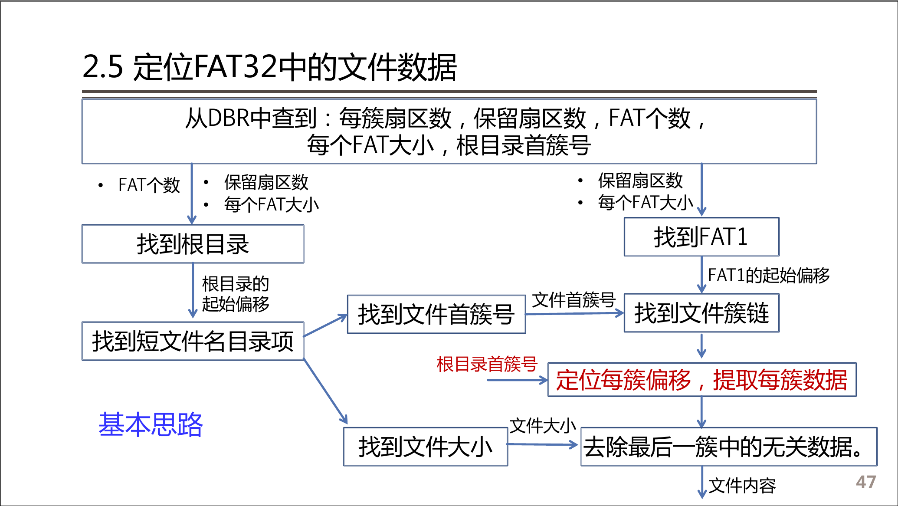

# FAT32 文件系统解析

## 说明

目前目标完成Windows下的文件系统解析

建议WinHex下的操作都完成一遍，不过来一个人写报告

## 流程



## 任务分解

一些基本功能：

1. 读指定扇区
2. 根据簇号算扇区号
3. 目录项解析
   
   找到短文件名目录项，转换。

找文件：

1. 读`DBR`（构建数据结构）
   1. 构建`struct DBR`
   2. 算出来根目录首簇号
2. 找到`FAT1`表扇区号
3. 处理文件路径（为了简单这里可以先假定文件在根目录。），返回目标文件短文件名目录项(同时要完成目录项的解析)。
4. 找到文件对应的完整簇链
5. 把簇链对应的内容写到文件里

## 数据结构和接口

### 数据结构

1. 扇区 (便于跨平台)

   ```c
   struct Sector{
   	unsigned long read_pos;
   	char * data;
   };
   ```

3. BPB
   ```c
   struct BPB{
       unsigned short byte_per_sector; // 每扇区字节数
       unsigned char sector_per_cluster; // 每簇扇区数
       unsigned short reserved_sector_cnt; // 保留扇区数目
       unsigned char FAT_cnt; // FAT个数
       unsigned int DBR_byte_size; // DBR分区占字节数
       unsigned int sector_per_FAT; // FAT占用扇区数
       unsigned int BPR_root_clus;
   };
   ```
4. FAT表项（簇链）

   ``` c
   struct Cluster{
       unsigned long cluster_no;
       struct Cluster * next_cluster;
   }
   ```

5. 目录项

   ```c
   struct ShortFile{
       unsigned char info; // 属性值
       char ext[3];
       char name[8];
       unsigned char attr; // 属性
       unsigned int first_cluster;
       unsigned int file_length;
   };


6. 目录栈（处理文件路径用，暂时不是很重要）


