# 武汉大学国家网络安全学院教学实验报告

|   课程名称   |  软件安全实验  |   实验日期   | 2022.10.12 |
| :----------: | :------------------: | :----------: | :-------: |
| **实验名称** | **磁盘结构与文件系统** | **实验周次** | **第1周** |
|   **姓名**   |       **学号**       |   **专业**   | **班级**  |
|    郑炳捷    |     2020302181024    |   信息安全   |     2020级1班     |
|    刘莫寒    |    2020302181021     |   信息安全   |     2020级1班     |
|    靖子萸    |    2020302181003     |   信息安全   |     2020级1班     |

## 实验目的及实验内容

### 实验目的

1. 加深对FAT32分区及文件系统格式的理解。
2. 掌握借助WinHex等工具手工定位磁盘文件数据的技能。
3. 通过开发一个磁盘文件数据提取工具，强化编程实践能力。

### 实验内容

- 内容一：手工定位和提取FAT32分区中的文件数据

  在FAT32分区下创建一个不小于10K的Word文档，根据课上介绍的FAT32分区及文件系统知识，必要时自行上网查阅相关资料，借助WinHex或其它十六进制工具，以手工方式从磁盘中逐一找到该文件的各个存储扇区，复制其中的有效内容，并拼接组合成一个与原文档内容相同的完整文档。

- 内容二：编程实现“内容一”的全过程

  输入：某个文件（A）的路径
  
  输出：
  - 该文件的短文件名目录项信息
  - 该文件的簇链
  - 根据上述的文件簇链，从磁盘上提取数据并拼接而得的新文件（B） 
  - 文件A与文件B内容的比较结果（要求二者完全一致）

## 实验环境及实验步骤

### 实验环境

Windows 10（内容一）

WinHex 20.6 SR-1

### 实验步骤

- 内容一：

  在Windows系统下新建虚拟硬盘，新建逻辑分区并将文件系统设为FAT32。在这个新分区内创建目标Word文档，然后用WinHex查看该分区内容，并找到BPB、文件分区表和目标Word文档的地址并分析内容，修改文件分区表和对应的簇，从而达到复制文件的目的。

- 内容二：

## 实验过程分析

### 概念分析

- FAT32文件系统结构：

  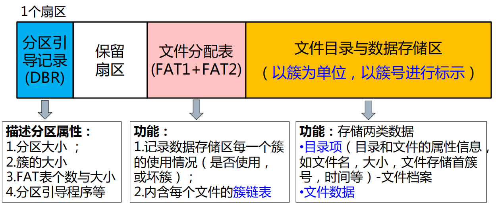

- DBR中的BIOS参数块（BPB）的重要字段：

  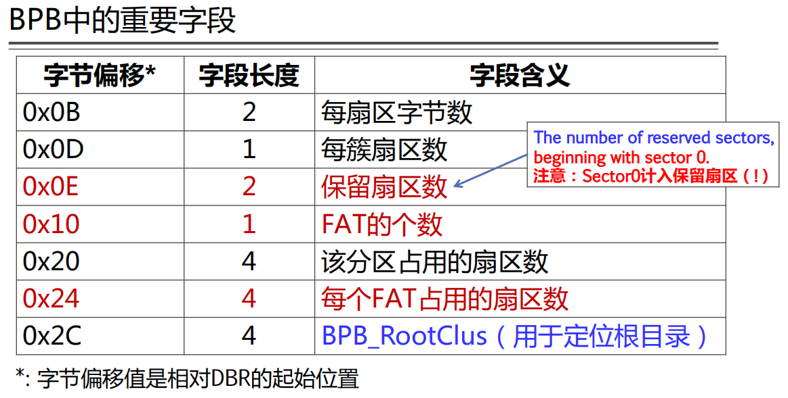

### 内容一

- 在Windows系统中右键单击计算机，选择管理，然后点击左侧磁盘管理，进入磁盘管理界面。右键单击左侧的磁盘管理，选择创建VHD，选择合适的选项然后创建虚拟硬盘，这个时候能看到界面下方出现了刚出现的虚拟硬盘。右键单击虚拟硬盘的未分配空间，选择新建简单卷，然后设置合适的分区大小（我设置的是64MB），然后将文件系统设置为FAT32。

  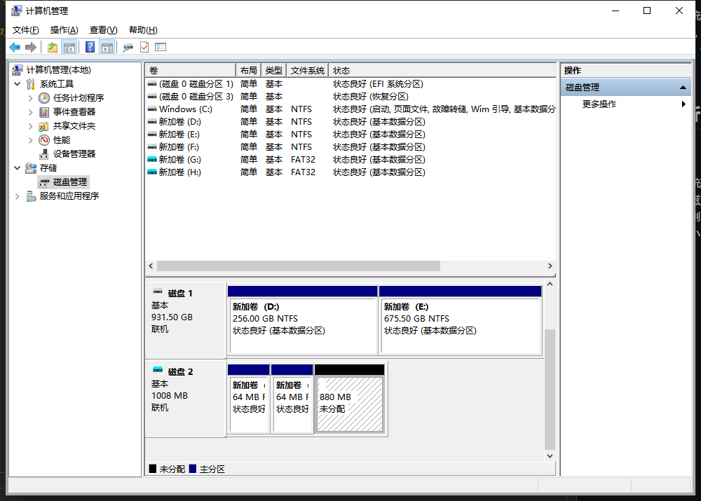

- 在新建的G盘中写一个符合要求的Word文档并保存。

  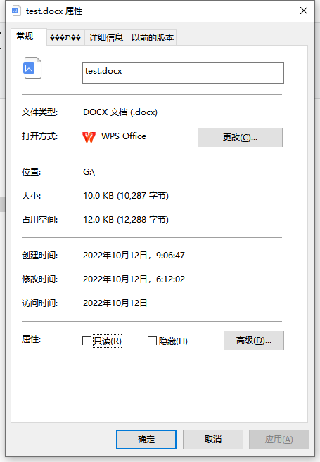

- 打开WinHex，然后选择工具栏中的打开磁盘，选择逻辑分区G，即可看到硬盘的数据。可以看到DBR就在偏移0x0的位置：

  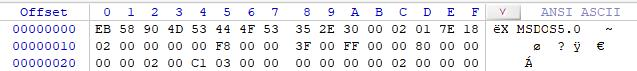

  分析数据得到下表：

  |   字节偏移   |  字段长度  |   字段内容   | 字段含义 |
  | :----------: | :------------------: | :----------: | :-------: |
  |    0x0B    |     2    |   0x0200   |     每扇区512字节     |
  |    0x0D    |     1    |   0x01   |     每簇1扇区     |
  |    0x0E    |     2    |   0x187E   |     6270个保留扇区     |
  | 0x10 | 1 | 0x02 | 两个文件分区表FAT |
  | 0x20 | 4 | 0x00020000 | 分区占用131072扇区 |
  | 0x24 | 4 | 0x000003C1 | 每个FAT占用961个扇区 |
  | 0x2C | 4 | 0x00000002 | BPB_RootClus = 2 |

  通过上面的数据可以得到：1簇恰好为1扇区，大小为512字节；共6270个保留扇区，每个FAT大小为961扇区，所以FAT1在6270扇区，FAT2在6270+961=7231扇区，根目录在7231+961=8192扇区（簇2）。

  跳转至6270扇区查看FAT1：

  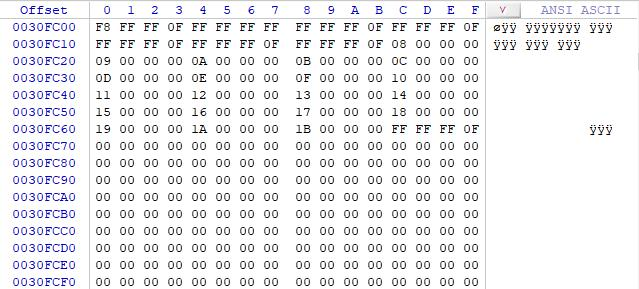

  结合十六进制数据和WinHex的详细数据区可以看出，我们所创建的test.docx所占用的簇号为0x07至0x1B即簇7至簇27。

  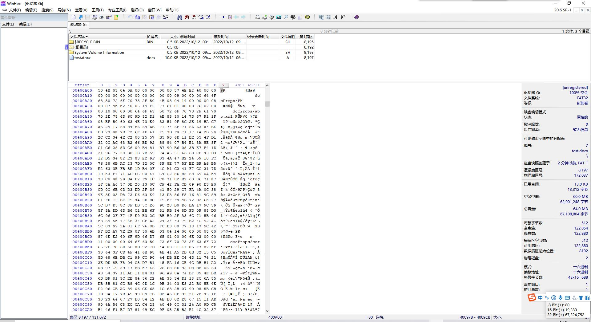

  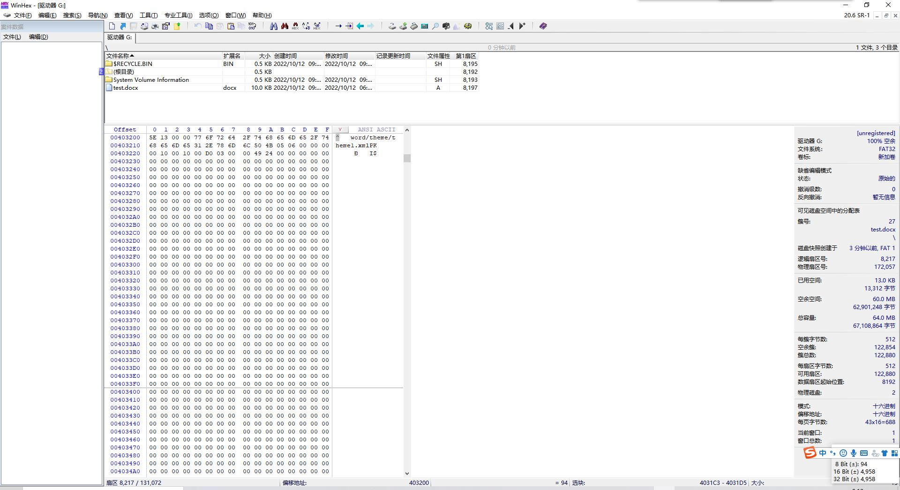

  可以看到该Word文档确实是从簇7开始存储至簇27，并且簇28目前是空的。

  修改文件分区表，新增簇链0x1C至0x30即簇28至簇48，与原文件大小保持一致，然后复制簇7至簇27的所有内容，粘贴到簇28开始处。（下图中蓝色为修改部分）

  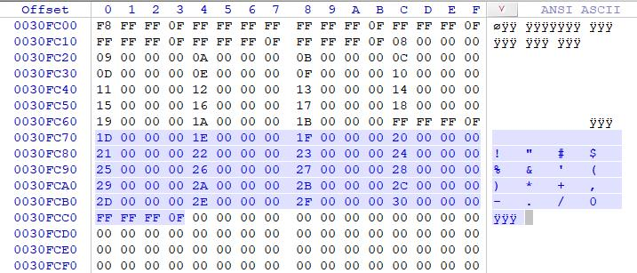

  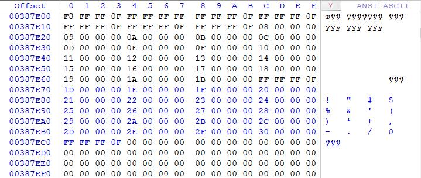

  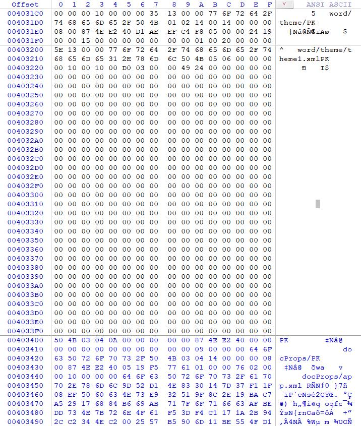

  在上方菜单栏中选择文件-保存扇区保存刚才的修改，但是发现此时资源管理器中并没有复制出来的新文件，于是回到WinHex中，在上方菜单栏中选择工具-磁盘工具-通过文件类型恢复，选择Documents文件类型来恢复数据。然后重新查看资源管理器，发现恢复出了两个Word文档和一个WinHex的log文件。
  
  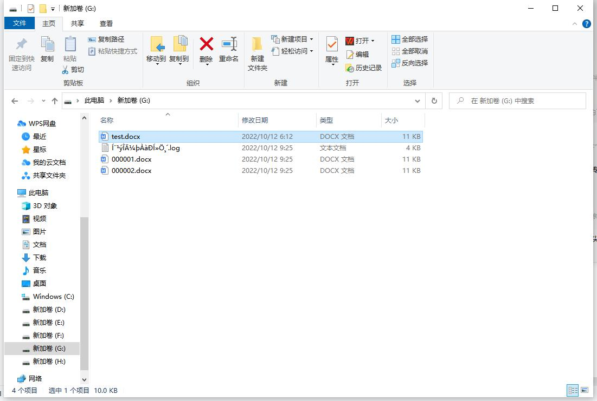

  对比三个文件的内容，发现它们完全一致，确实成功完全复制。

  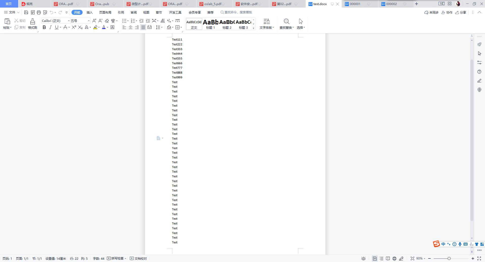

  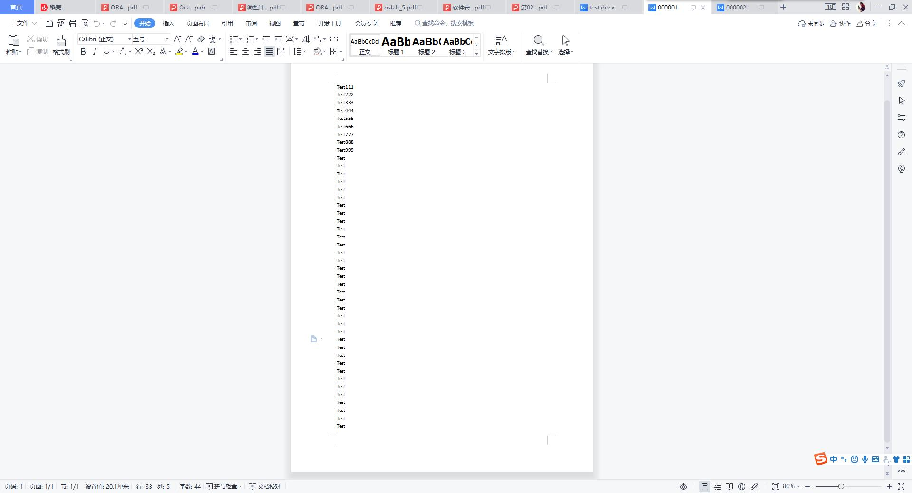
  
  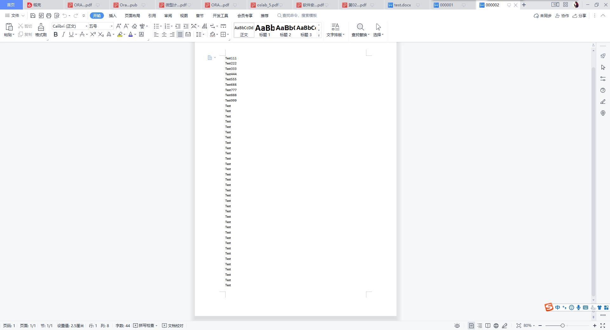

  推测恢复出两个文件的原因是我同时修改了FAT1和FAT2，而FAT2是FAT1的备份，在扫描硬盘时两个簇链均被识别并恢复成一个文件（当做另一个文件分区表损坏来识别），导致出现了两个恢复文件。于是我将FAT2的对应簇链删除，再次使用恢复文件功能，发现这次只识别出了1个文件头部信息，并且刷新磁盘快照后，FAT2被删除的部分再次恢复，猜想得到验证。

  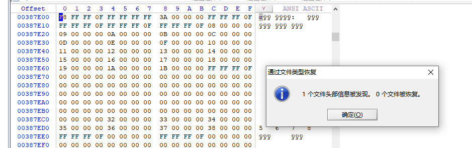

### 内容二

## 实验结果总结与故障记录

## 各人贡献与心得体会

通过本次实验，我们对FAT32分区及文件系统格式有了更深刻的理解，并且初步学习了硬盘数据分析工具的使用。本次实验中，郑炳捷负责内容一的全部相关内容。

## 教师评价

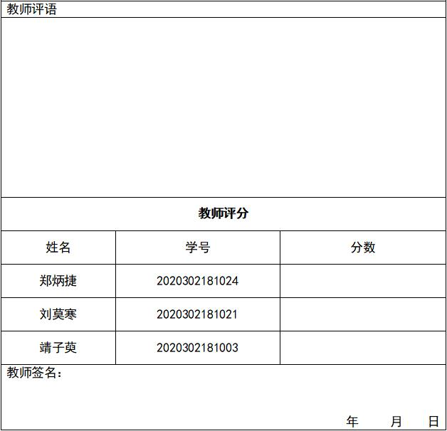